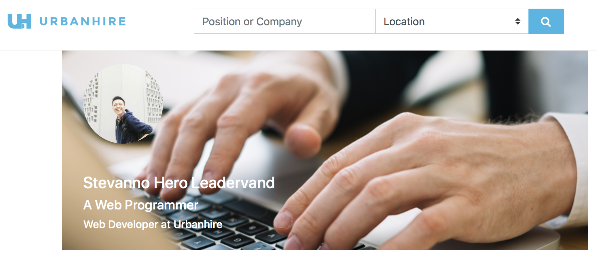

# Urbanhire Front-end Assignment
Stevanno Hero Leadervand

# Project's Page
[Visit my project](https://stevannohero.github.io/urbanhire-layout/)

# Library
Build responsive, mobile-first projects on the web with the world's most popular front-end component library.

Bootstrap is an open source toolkit for developing with HTML, CSS, and JS. Quickly prototype your ideas or build your entire app with our Sass variables and mixins, responsive grid system, extensive prebuilt components, and powerful plugins built on jQuery.

[Bootstrap's Documentations](https://getbootstrap.com/docs/4.1/getting-started/introduction/)

### Bandung Institute of Technology, 2018.
